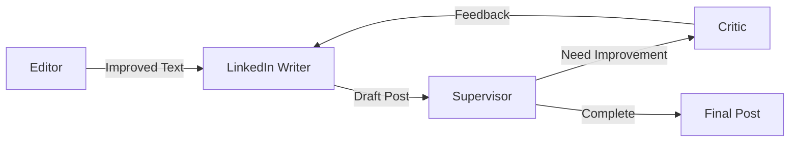

# LinkedIn Post Generator Agent 🤖 [POC]

> **Note**: This project is an educational proof of concept exploring the possibilities of AI-driven content generation and workflow automation using LangGraph. It is not intended for production use.

An intelligent agent that transforms plain text into engaging LinkedIn posts through an iterative, feedback-driven approach. Built with LangGraph and Ollama, it demonstrates how AI can simulate a team of content experts working together.

## 📋 Table of Contents

- [Overview](#overview)
- [Key Features](#key-features)
- [Technical Architecture](#technical-architecture)
- [Getting Started](#getting-started)
- [Usage Examples](#usage-examples)
- [Development](#development)
- [Contributing](#contributing)

## 🎯 Overview

### Concept

This proof of concept demonstrates how AI can simulate a collaborative content creation process. The agent orchestrates a virtual team of specialists, each focusing on different aspects of content optimization.

### The Virtual Team

#### 1. The Editor 📝

```python
# agent.py
def editor_node(self, state: OverallState) -> Dict[str, Any]:
    """Improves text clarity and structure"""
    prompt = f"""
        text:
        ```
        {state["user_text"]}
        ```
    """.strip()
    response = self._get_prompt_response(EDITOR_PROMPT, prompt)
    # Returns improved text structure and clarity
```

- Enhances readability
- Fixes grammatical issues
- Preserves core message

#### 2. The LinkedIn Writer 💼

```python
# agent.py
def linkedin_writer_node(self, state: OverallState) -> Dict[str, Any]:
    """Creates LinkedIn-optimized content"""
    post = Post(**state["linkedin_post"])
    feedback_section = self._build_feedback_section(post)
    # Generates engaging LinkedIn content
```

- Formats for LinkedIn
- Optimizes engagement
- Targets specific audience

#### 3. The Critic 🔍

```python
# agent.py
def critique_linkedin_node(self, state: OverallState) -> Dict[str, Any]:
    """Analyzes and provides constructive feedback"""
    prompt = f"""
        Original text: {state["edit_text"]}
        Current LinkedIn post: {post.get_latest_draft()}
        Target audience: {state["target_audience"]}
    """
    # Provides professional feedback
```

- Evaluates professionalism
- Assesses engagement potential
- Suggests improvements

#### 4. The Supervisor 👨‍💼

```python
# agent.py
def supervisor_node(self, state: OverallState) -> OverallState:
    """Manages workflow state and iterations"""
    if len(post.drafts) >= state["n_drafts"]:
        state["workflow_status"] = WorkflowStatus.COMPLETED
    # Controls iteration flow
```

## 🔑 Key Features

- **Iterative Improvement**: Multiple drafts with feedback incorporation
- **Audience-Focused**: Content tailored to specific target audiences
- **Professional Tone**: Maintains LinkedIn-appropriate language and format
- **Flexible Configuration**: Customizable number of iterations and parameters

## 🏗 Technical Architecture

### Core Components

1. **Workflow State Management**

```python
# agent.py
class WorkflowStatus(str, Enum):
    """Tracks the current state of content generation"""
    STARTING = "starting"
    IN_PROGRESS = "in_progress"
    COMPLETED = "completed"
```

2. **Content Management**

```python
# agent.py
class Post(BaseModel):
    """Manages post versions and feedback"""
    drafts: list[str] = Field(default_factory=list)
    feedback: Optional[str] = None

    def add_draft(self, draft: str) -> None:
        """Adds a new version of the post"""
        self.drafts.append(draft)
```

3. **Workflow Configuration**

```python
# agent.py
class Configuration(BaseModel):
    """Defines workflow parameters"""
    n_drafts: int = Field(default=DEFAULT_N_DRAFTS, gt=0)
```

### Workflow Diagram



## 🚀 Getting Started

### Prerequisites

- Docker and Docker Compose
- Python 3.11+
- Ollama
- LangGraph Studio (optional, for visual workflow management)

### 🐳 Docker Deployment

### Quick Start with Docker

```bash
# Build and start the container
docker-compose up --build

# The API will be available at:
# - API: http://localhost:8000
```

### API Endpoints

#### Generate Post
```bash
curl -X POST http://localhost:8000/generate \
  -H "Content-Type: application/json" \
  -d '{
    "text": "We are launching a new AI product that revolutionizes data analysis",
    "target_audience": "Tech leaders and CTOs",
    "n_drafts": 3
  }'
```

Response:
```json
{
  "final_post": "...",
  "all_versions": [
    {
      "version": 1,
      "content": "...",
      "feedback": null
    },
    {
      "version": 2,
      "content": "...",
      "feedback": "..."
    }
  ],
  "workflow_status": "completed"
}
```

#### Health Check
```bash
curl http://localhost:8000/health
```

### Docker Configuration

The application runs in a self-contained Docker environment that includes:

- FastAPI application
- Ollama LLM
- All required dependencies

Key features:

- Persistent model storage
- Health monitoring
- Automatic model download
- Environment variable configuration

### Environment Variables

```env
DOCKER_CONTAINER=true
OLLAMA_BASE_URL=http://localhost:11434
```

### Container Management

```bash
# Start containers
docker-compose up -d

# View logs
docker-compose logs -f

# Stop containers
docker-compose down

# Rebuild after changes
docker-compose up --build
```

### Manual Installation

- Python 3.11+
- Ollama
- LangGraph Studio (optional, for visual workflow management)

### Installation

1. Clone the repository:

```bash
git clone [REPO_URL]
cd linkedin-agent
```

2. Install dependencies:

```bash
pip install .
```

3. Set up Ollama:

```bash
# Install Ollama
curl -fsSL https://ollama.com/install.sh | sh

# Start Ollama service
ollama serve

# Pull required model
ollama pull llama3
```

## 💡 Usage Examples

### Basic Usage

```python
from agent import generate_linkedin_post

# Simple post generation
text = """
We're excited to announce our new AI-powered analytics platform 
that helps businesses make data-driven decisions faster than ever.
"""
audience = "Tech-savvy business leaders and CTOs"
result = generate_linkedin_post(text, audience)

# Access the final version
final_post = result["linkedin_post"]["drafts"][-1]
```

### Advanced Configuration

```python
# Customize the number of improvement iterations
result = generate_linkedin_post(
    text=text,
    target_audience=audience,
    n_drafts=5  # More iterations for higher quality
)

# Access intermediate versions and feedback
for i, draft in enumerate(result["linkedin_post"]["drafts"]):
    print(f"Draft {i+1}:\n{draft}\n")
    if result["linkedin_post"]["feedback"]:
        print(f"Feedback:\n{result['linkedin_post']['feedback']}\n")
```

### Using with LangGraph Studio

1. Start LangGraph Studio
2. Load the project configuration:

```json
// langgraph.json
{
  "graphs": {
    "linkedin_workflow": "./agent.py:build_linkedin_workflow"
  }
}
```

3. Use the visual interface to test different inputs

## 🔧 Development

### Project Structure

```
linkedin-agent/
├── agent.py          # Core agent implementation
├── pyproject.toml    # Project configuration
├── langgraph.json    # LangGraph Studio config
└── README.md         # Documentation
```

## 📄 License

This project is released under the [MIT License](LICENSE).

```
MIT License

Copyright (c) 2024 Romain Portanguen

Permission is hereby granted, free of charge, to any person obtaining a copy
of this software and associated documentation files (the "Software"), to deal
in the Software without restriction, including without limitation the rights
to use, copy, modify, merge, publish, distribute, sublicense, and/or sell
copies of the Software, and to permit persons to whom the Software is
furnished to do so, subject to the following conditions:

The above copyright notice and this permission notice shall be included in all
copies or substantial portions of the Software.

THE SOFTWARE IS PROVIDED "AS IS", WITHOUT WARRANTY OF ANY KIND, EXPRESS OR
IMPLIED, INCLUDING BUT NOT LIMITED TO THE WARRANTIES OF MERCHANTABILITY,
FITNESS FOR A PARTICULAR PURPOSE AND NONINFRINGEMENT. IN NO EVENT SHALL THE
AUTHORS OR COPYRIGHT HOLDERS BE LIABLE FOR ANY CLAIM, DAMAGES OR OTHER
LIABILITY, WHETHER IN AN ACTION OF CONTRACT, TORT OR OTHERWISE, ARISING FROM,
OUT OF OR IN CONNECTION WITH THE SOFTWARE OR THE USE OR OTHER DEALINGS IN THE
SOFTWARE. 
```

See the [LICENSE](LICENSE) file for full details.

## ⚠️ Disclaimer

This is a proof of concept for educational purposes. While it demonstrates interesting possibilities in AI-driven content generation, it should not be considered production-ready software.
## 📚 Resources

- [LangGraph Documentation](https://python.langchain.com/docs/langgraph)
- [Ollama Documentation](https://ollama.com/)
- [LinkedIn Content Best Practices](https://members.linkedin.com/create)

